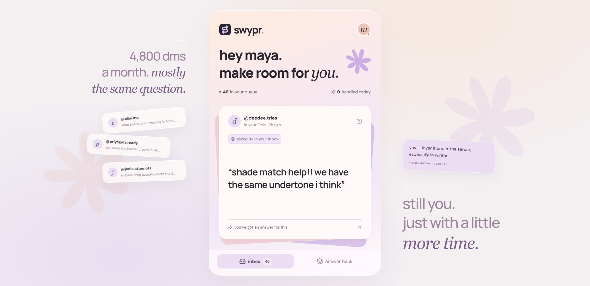
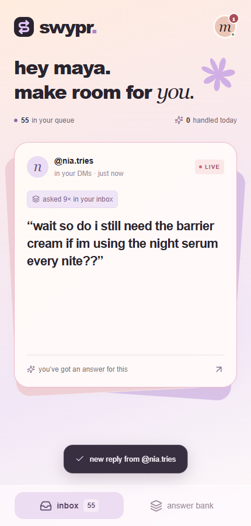
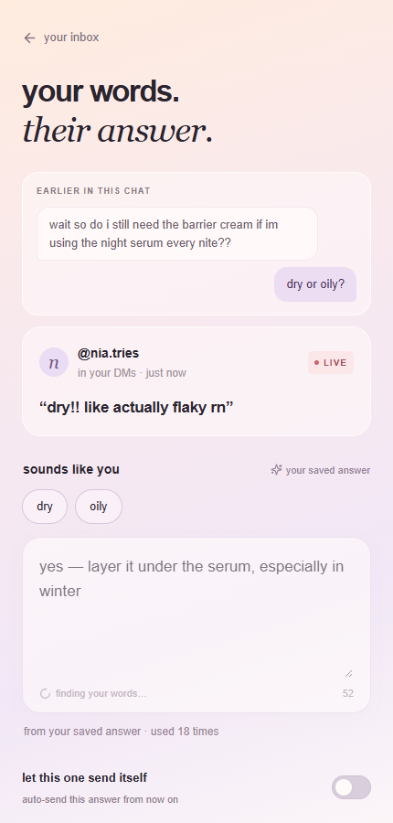

# Swypr

**A creator inbox that answers the repeats — so the messages that matter get a human.**

Creators with large audiences get thousands of DMs a month, and most of them are the same handful of questions. Swypr clusters the repeats, lets the creator answer each one **once** as a small decision tree (question → optional clarifying question → up to two branches), and drafts a reply in her voice for every future match — approved with one tap, or auto-sent once she trusts the answer. What she hasn't answered yet becomes her content pipeline.



## Features

- **Swipe queue** — a card stack of unanswered DMs with spring physics: swipe left to skip, right or tap to answer. Live messages slide in with a LIVE tag via 2-second polling.
- **Decision-tree answers** — flat answers or forks behind a clarifying question ("dry or oily?"). If the incoming message already reveals the answer ("my skin is so dry"), the branch reply is drafted directly and the question is skipped.
- **Conversations** — messages group by sender, threads render above the draft, and a reply to an open clarifying question is automatically resolved against the tree's branches.
- **Voice-true drafting** — branch text is lightly rewritten by an LLM into the creator's register with a hard 3-second timeout; on any failure the exact saved text is used. The app is fully functional with zero LLM calls.
- **Answer Bank** — every saved answer with asked/used counts, expandable forks with the past replies each answer was built from, live coverage stats, and the top unanswered themes.
- **Export for your AI** — one tap composes a markdown content brief (what the audience asked this month, with verbatim example questions) for pasting into any assistant, with copy and download.
- **Auto-send** — per-answer trust toggle; flipping it on sweeps every waiting match out the door and handles future arrivals on sight.
- **Real delivery rails** — a Meta webhook receiver (verification handshake, echo/read-receipt filtering, tester whitelist) and Instagram Graph API send, with a simulate mode that falls back gracefully and flags itself in the response.
- **Installable PWA** — standalone display, safe-area handling, and a desktop stage that presents the phone UI full-height with inner scrolling.

<p align="center">
  
  
</p>

## Stack

React 18 · Vite · Framer Motion · Node 20 + Express · JSON file persistence (no database) · OpenAI / Anthropic APIs for draft rewriting

## Run it

```sh
pnpm install
cp .env.example .env       # defaults work out of the box (simulate mode, no keys required)
pnpm run build             # build the frontend once
pnpm run server            # everything on http://localhost:3001
```

For frontend development with hot reload, also run `pnpm dev` and open http://localhost:5173 (the `/api` proxy targets the server). Set `OPENAI_API_KEY` (or `ANTHROPIC_API_KEY`) in `.env` to enable voice rewriting; without a key, drafts serve the saved answer text verbatim.

## Demo controls

| Key | Action |
|-----|--------|
| `L` | Inject the next scripted incoming DM (barrier question → the sender's "dry" reply → a product ask → an off-map question that lands honestly unanswered) |
| `R` | Reset the scripted sequence |
| `G` | Bring the Glass Drop question to the top of the stack |
| `?` | Show shortcuts |

## API

| Route | Description |
|-------|-------------|
| `GET /api/queue` | Messages (unanswered first, newest live on top) + live stats |
| `GET /api/clusters` | Question clusters with counts and linked answers |
| `GET /api/trees` · `POST /api/trees` · `PATCH /api/trees/:id` · `DELETE /api/trees/:id` | Saved answers; create re-runs matching over the unanswered queue |
| `POST /api/messages/:id/draft` | Build the reply draft, optionally with `{ context }` to pick a branch |
| `POST /api/messages/:id/send` · `POST /api/messages/:id/skip` | Deliver (live or simulated) / skip |
| `POST /api/simulate-incoming` | Inject a live-looking DM; `{ reset: true }` clears injections |
| `GET /api/answer-bank` | Saved answers, stats, and top unanswered themes with verbatim examples |
| `GET·POST /webhook/instagram` | Meta verification handshake + DM receiver |

Matching is keyword-first (product names + question stems); an LLM classifier runs only for live-source messages when keywords miss, and never inside `GET /api/queue`. Stats are computed from the data at request time.

## Project structure

```
src/                 React app (queue, answer flow, answer bank, builder)
server/
  routes/            queue, trees, send, webhook
  lib/               matching, drafts, instagram delivery, JSON store
  data/              seed corpus, products, saved answers
public/mock/         contract-shaped fixture for backend-free development
```

## License

MIT
